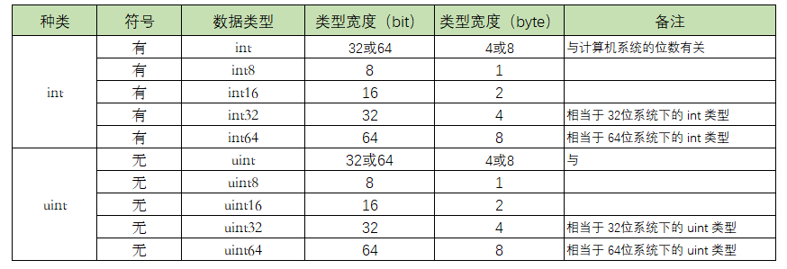
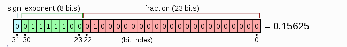
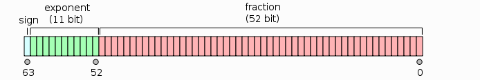

# 数据类型

## <font color="06FAFA">变量创建的五种方法</font>
①一行声明一个变量
```go
var <name> <type>
```


②多个变量一起声明
```go
var (
    name string
    age int
    gender string
)
```


③声明和初始化一个变量
> 使用 := （推导声明写法或者短类型声明法：编译器会自动根据右值类型推断出左值的对应类型。），可以声明一个变量，并对其进行（显式）初始化。
```go
name := "Go编程时光"
// 等价于
var name string = "Go编程时光"
// 等价于
var name = "Go编程时光"
```
> 但这种方法有个限制就是，只能用于函数内部
  

④声明和初始化多个变量  
> 这种方法，也经常用于变量的交换
```go
var a int = 100
var b int = 200
b, a = a, b
```


⑤new 函数声明一个指针变量

```go
package main

import "fmt"

func main()  {
    var age int = 28
    var ptr = &age  // &后面接变量名，表示取出该变量的内存地址
    fmt.Println("age: ", age)
    fmt.Println("ptr: ", ptr)
}
```


变量/常量都只能声明一次，声明多次，编译就会报错。

但也有例外，这就要说到一个特殊变量：`匿名变量`，也称作占位符，或者空白标识符，用下划线表示。  
匿名变量，优点有三：

- 不分配内存，不占用内存空间
- 不需要你为命名无用的变量名而纠结
- 多次声明不会有任何问题

通常我们用匿名接收必须接收，但是又不会用到的值。
```go
func GetData() (int, int) {
    return 100, 200
}
func main(){
    a, _ := GetData()
    _, b := GetData()
    fmt.Println(a, b)
}
```


# 数据类型

## <font color="06FAFA">整型</font>



> int 和 uint 的区别就在于一个 u，有 u 说明是无符号，没有 u 代表有符号。  


不同进制的表示方法
- 2进制：以0b或0B为前缀
- 8进制：以0o或者 0O为前缀
- 16进制：以0x 为前缀


## <font color="06FAFA">浮点型</font>


float32，也即我们常说的单精度，存储占用4个字节，也即4*8=32位，其中1位用来符号，8位用来指数，剩下的23位表示尾数

  
float64，也即我们熟悉的双精度，存储占用8个字节，也即8*8=64位，其中1位用来符号，11位用来指数，剩下的52位表示尾数


> <font color="#FF0000">由此可知，float32 和 float64 可以表示的数值很多，数值很大但精度有限</font>


## <font color="06FAFA">byte类型和rune类型</font>

byte，占用1个节字，就 8 个比特位（2^8 = 256，因此 byte 的表示范围 0->255），所以它和 uint8 类型本质上没有区别，它表示的是 ACSII 表中的一个字符。  
rune，占用4个字节，共32位比特位，所以它和 uint32 本质上也没有区别。它表示的是一个 Unicode字符（Unicode是一个可以表示世界范围内的绝大部分字符的编码规范）。

> <font color="E8FF11">思考：</font>  
> byte 和 uint8 没有区别，rune 和 uint32 没有区别，那为什么还要多出一个 byte 和 rune 类型呢？  
> 理由很简单，因为uint8 和 uint32 ，直观上让人以为这是一个数值，但是实际上，它也可以表示一个字符，所以为了消除这种直观错 觉，就诞生了 byte 和 rune 这两个别名类型。


## <font color="06FAFA">字符串类型</font>

字符串，可以说是大家很熟悉的数据类型之一。定义方法很简单
```go
var mystr string = "hello"
```

表示 \r\n 这个 字符串，使用双引号是这样写的，这种叫解释型表示法
```go
var mystr01 string = "\\r\\n"
```
而使用反引号，就方便多了，所见即所得，这种叫原生型表示法
```go
var mystr02 string = `\r\n`
```
> 使用反引号包裹的字符串，相当于 Python 中的 raw 字符串，会忽略里面的转义。


## <font color="06FAFA">字典</font>

字典（Map 类型），是由若干个 key:value 这样的键值对映射组合在一起的数据结构。
它的每个映射里的key都是唯一的。
在声明字典时，必须指定好你的key和value是什么类型的，然后使用 map 关键字来告诉Go这是一个字典。

声明初始化字典

```go
// 第一种方法
var scores map[string]int = map[string]int{"english": 80, "chinese": 85}

// 第二种方法
scores := map[string]int{"english": 80, "chinese": 85}

// 第三种方法
scores := make(map[string]int)
scores["english"] = 80
scores["chinese"] = 85
```
添加元素
```go
scores["math"] = 95
```
更新元素，若key已存在，则直接更新value
```go
scores["math"] = 100
```
读取元素，直接使用 [key] 即可 ，如果 key 不存在，也不报错，会返回其value-type 的零值。
```go
fmt.Println(scores["math"])
```
删除元素，使用 delete 函数，如果 key 不存在，delete 函数会静默处理，不会报错。
```go
delete(scores, "math")
```
> 当访问一个不存在的key时，并不会直接报错，而是会返回该字典value的类型的默认值

#### <font color="#FF69B4" size="4">字典循环</font>
循环分三种

①获取 key 和 value
```go
import "fmt"

func main() {
    scores := map[string]int{"english": 80, "chinese": 85}

    for subject, score := range scores {
        fmt.Printf("key: %s, value: %d\n", subject, score)
    }
}
```
②只获取key，这里注意不用占用符。
```go
import "fmt"

func main() {
    scores := map[string]int{"english": 80, "chinese": 85}

    for subject := range scores {
        fmt.Printf("key: %s\n", subject)
    }
}
```
③只获取 value，用一个占位符替代。
```go
import "fmt"

func main() {
    scores := map[string]int{"english": 80, "chinese": 85}

    for _, score := range scores {
        fmt.Printf("value: %d\n", score)
    }
}
```

## <font color="06FAFA">布尔类型</font>

在 Python 中，真值用 True 表示，与 1 相等，假值用 False 表示，与 0 相等  
而在 Go 中，真值用 true 表示，不但不与 1 相等，并且更加严格，不同类型无法进行比较，而假值用 false 表示，同样与 0 无法比较。  

Go 中确实不如 Python 那样灵活，bool 与 int 不能直接转换，如果要转换，需要你自己实现函数。

bool 转 int
```go
func bool2int(b bool) int {
    if b {
        return 1
    }
    return 0
}
```
int 转 bool
```go
func int2bool(i int) bool {
    return i != 0
}
```
在 Python 中使用 not 对逻辑值取反，而 Go 中使用 `!` 符号


一个 if 判断语句，有可能不只一个判断条件，在 Python 中是使用 and 和 or 来执行逻辑运算

而在 Go 语言中，则使用 && 表示且，用 || 表示或，并且有短路行为（即左边表达式已经可以确认整个表达式的值，那么右边将不会再被求值。

